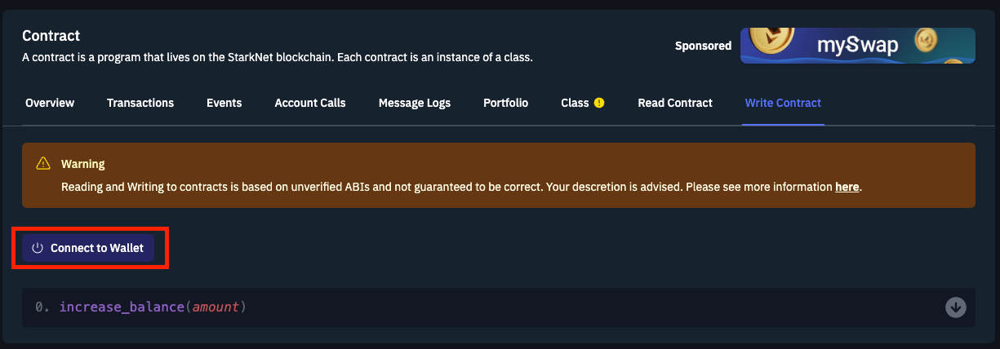
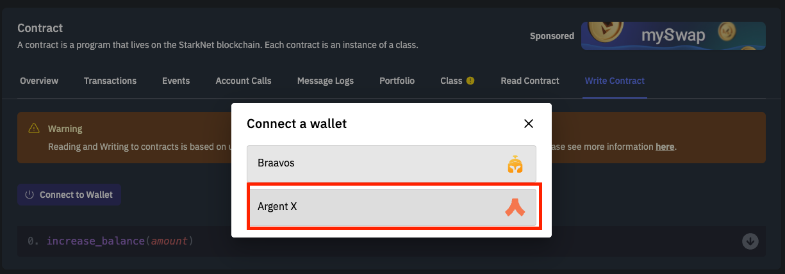

# Cairo
Cairo is StarkNet's native language and the first Turing-complete language for scripting provable programs (where one party can prove to another that a certain computation was executed correctly) for general computations.
# StarkNet
StarkNet is a decentralized ZK-rollup that operates as an Ethereum layer 2 chain. StarkNet enables Decentralized applications to achieve unlimited scale for their computation - without compromising Ethereum's decentralization and security, thereby solving the Scalability Trilemma.

In this document, we are going to be going in-depth into understanding Cairo's syntax and how you could create and deploy a Cairo smart contract on StarkNet.

**NB: As at the time of this writing, StarkNet is still at v0.10.3, with Cairo 1.0 coming soon. The ecosystem is young and evolving very fast, so you might want to check the [official docs](https://www.cairo-lang.org/docs) to confirm this document is still up-to-date. Pull requests are welcome!**

# Setting Up A Development Environment
Before we get started writing codes, we will need to setup a Cairo development environment, for writing, compiling and deploying our contracts to StarkNet. 
For the purpose of this tutorial we are going to be using the [Protostar Framework](https://github.com/software-mansion/protostar). Installation steps can be found in the docs [here](https://docs.swmansion.com/protostar/docs/tutorials/installation).
Note that Protostar supports just Mac and Linux OS, Windows users might need to use WSL, or go for other alternatives such as the Official [StarkNet CLI](https://www.cairo-lang.org/docs/quickstart.html) or [Nile from Openzeppelin](https://github.com/OpenZeppelin/nile)

Once you're done with the installations, run the command `protostar -v` to confirm your installation was successful. If successful, you should see your Protostar version displayed on the screen. 

## Initializing a new project
Protostar similar to Truffle for solidity development can be installed once and used for multiple projects.
To initialize a new Protostar project, run the following command:
```
protostar init
```

2. It would then request the project's name and the library's directory name, you'd need to fill in this, and a new project will be initialized successfully.

# Compiling, Declaring, Deploying And Interacting With StarkNet Contracts
For the purpose of this tutorial, head over to this [github repo](https://github.com/Darlington02/CairoLearnXinYminutes) and clone locally.

Within the `src` folder you'll find a boilerplate contract that comes with initializing a new Protostar project, `main.cairo`. We are going to be compiling, declaring and deploying this contract.

## Compiling Contracts
To compile a Cairo contract using Protostar, ensure a path to the contract is specified in the `[contracts]` section of the `protostar.toml` file. Once you've done that, open your terminal and run the command:
```
protostar build
```
And you should get an output similar to what you see below, with a `main.json` and `main_abi.json` files created in the `build` folder.


## Declaring Contracts
With the recent StarkNet update to 0.10.3, the DEPLOY transaction was deprecated and no longer works. To deploy a transaction, you must first declare a Contract to obtain the class hash, then deploy the declared contract using the [Universal Deployer Contract](https://community.starknet.io/t/universal-deployer-contract-proposal/1864).

Before declaring or deploying your contract using Protostar, you should set the private key associated with the specified account address in a file, or in the terminal. To set your private key in the terminal, run the command:

```
export PROTOSTAR_ACCOUNT_PRIVATE_KEY=[YOUR PRIVATE KEY HERE]
```

Then to declare our contract using Protostar run the following command:
```
protostar declare ./build/main.json --network testnet --account 0x0691622bBFD29e835bA4004e7425A4e9630840EbD11c5269DE51C16774585b16 --max-fee auto
```

where `network` specifies the network we are deploying to, `account` specifies account whose private key we are using, `max-fee` specifies the maximum fee to be paid for the transaction. You should get the class hash outputted as seen below:


## Deploying Contracts
After obtaining our class hash from declaring, we can now deploy using the below command:
```
protostar deploy 0x02a5de1b145e18dfeb31c7cd7ff403714ededf5f3fdf75f8b0ac96f2017541bc --network testnet --account 0x0691622bBFD29e835bA4004e7425A4e9630840EbD11c5269DE51C16774585b16 --max-fee auto
```

where `0x02a5de1b145e18dfeb31c7cd7ff403714ededf5f3fdf75f8b0ac96f2017541bc` is the class hash of our contract.


## Interacting With Contracts
To interact with your deployed contract, we will be using Argent X (alternative - Braavos), and Starkscan (alternative - Voyager). To install and setup Argent X, check out this [guide](https://www.argent.xyz/learn/how-to-create-an-argent-x-wallet/).

Copy your contract address, displayed on screen from the previous step, and head over to [Starkscan](https://testnet.starkscan.co/) to search for the contract. Once found, you can make write calls to the contract by following the steps below:
1. Click on the "connect wallet" button

2. Select Argent X and approve the connection

3. You can now make read and write calls easily.

# Let's learn Cairo
```
    // First let's look at a default contract that comes with Protostar
    // Allows you to set balanace on deployment, increase, and get the balance.

    // Language directive - instructs compiler its a StarkNet contract
    %lang starknet

    // Library imports from the Cairo-lang library
    from starkware.cairo.common.math import assert_nn
    from starkware.cairo.common.cairo_builtins import HashBuiltin

    // @dev Storage variable that stores the balance of a user. 
    // @storage_var is a decorator that instructs the compiler the function below it is a storage variable.
    @storage_var
    func balance() -> (res: felt) {
    }

    // @dev Constructor writes the balance variable to 0 on deployment
    // Constructors sets storage variables on deployment. Can accept arguments too.
    @constructor
    func constructor{syscall_ptr: felt*, pedersen_ptr: HashBuiltin*, range_check_ptr}() {
        balance.write(0);
        return ();
    }

    // @dev increase_balance updates the balance variable
    // @param amount the amount you want to add to balance
    // @external is a decorator that specifies the func below it is an external function.
    @external
    func increase_balance{syscall_ptr: felt*, pedersen_ptr: HashBuiltin*, range_check_ptr}(
        amount: felt
    ) {
        with_attr error_message("Amount must be positive. Got: {amount}.") {
            assert_nn(amount);
        }

        let (res) = balance.read();
        balance.write(res + amount);
        return ();
    }

    // @dev returns the balance variable
    // @view is a decorator that specifies the func below it is a view function. 
    @view
    func get_balance{syscall_ptr: felt*, pedersen_ptr: HashBuiltin*, range_check_ptr}() -> (res: felt) {
        let (res) = balance.read();
        return (res,);
    }

    // before proceeding, try to build, deploy and interact with this contract! 
    // NB: Should be at main.cairo if you are using Protostar.

```
Now unto the main lessons

### 1. THE FELT DATA TYPE
```
    // Unlike solidity, where you have access to various data types, Cairo comes with just a single data type..felts
    // Felts stands for Field elements, and are a 252 bit integer in the range 0<=x<=P where P is a prime number.
    // You can create a Uint256 in Cairo by utlizing a struct of two 128 bits felts.

    struct Uint256 {
        low: felt, // The low 128 bits of the value.
        high: felt, // The high 128 bits of the value.
    }

    // To avoid running into issues with divisions, it's safer to work with the unsigned_div_rem method from Cairo-lang's library.
```

### 2. LANG DIRECTIVE AND IMPORTS
```
    // To get started with writing a StarkNet contract, you must specify the directive:

    %lang starknet

    // This directive informs the compiler you are writing a contract and not a program. 
    // The difference between both is contracts have access to StarkNet's storage, programs don't and as such are stateless.

    // There are important functions you might need to import from the official Cairo-lang library or Openzeppelin's. e.g.
    
    from starkware.cairo.common.cairo_builtins import HashBuiltin
    from cairo_contracts.src.openzeppelin.token.erc20.library import ERC20
    from starkware.cairo.common.uint256 import Uint256
    from starkware.cairo.common.bool import TRUE
```

### 3. DATA STRUCTURES
```
    // A. STORAGE VARIABLES
    // Cairo's storage is a map with 2^251 slots, where each slot is a felt which is initialized to 0.
    // You create one using the @storage_var decorator

        @storage_var
        func names() -> (name: felt){
        }

    // B. STORAGE MAPPINGS
    // Unlike soldity where mappings have a separate keyword, in Cairo you create mappings using storage variables.

        @storage_var
        func names(address: felt) -> (name: felt){
        }

    // C. STRUCTS
    // Structs are a means to create custom data types in Cairo.
    // A Struct has a size, which is the sum of the sizes of its members. The size can be retrieved using MyStruct.SIZE.
    // You create a struct in Cairo using the `struct` keyword.

        struct Person {
            name: felt,
            age: felt,
            address: felt,
        }

    // D. CONSTANTS
    // Constants are fixed and as such can't be altered after being set.
    // They evaluate to an integer (field element) at compile time.
    // To create a constant in Cairo, you use the `const` keyword.
    // Its proper practice to capitalize constant names.

        const USER = 0x01C6cfC1DB2ae90dACEA243F0a8C2F4e32560F7cDD398e4dA2Cc56B733774E9b

    // E. ARRAYS
    // Arrays can be defined as a pointer(felt*) to the first element of the array.
    // As an array is populated, its elements take up contigous memory cells.
    // The `alloc` keyword can be used to dynamically allocate a new memory segment, which can be used to store an array

        let (myArray: felt*) = alloc ();
        assert myArray[0] = 1;
        assert myArray[1] = 2;
        assert myArray[3] = 3;

    // You can also use the `new` operator to create fixed-size arrays using tuples
    // The new operator is useful as it enables you allocate memory and initialize the object in one instruction

        func foo() {
            tempvar arr: felt* = new (1, 1, 2, 3, 5);
            assert arr[4] = 5;
            return ();
        }

    // F. TUPLES
    // A tuple is a finite, ordered, unchangeable list of elements
    // It is represented as a comma-separated list of elements enclosed by parentheses
    // Their elements may be of any combination of valid types.

        local tuple0: (felt, felt, felt) = (7, 9, 13);

    // G. EVENTS
    // Events allows a contract emit information during the course of its execution, that can be used outside of StarkNet.
    // To create an event:

        @event
        func name_stored(address, name) {
        }

    // To emit an event:

        name_stored.emit(address, name);
```

### 4. CONSTRUCTORS, EXTERNAL AND VIEW FUNCTIONS
```
    // A. CONSTRUCTORS
    // Constructors are a way to intialize state variables on contract deployment
    // You create a constructor using the @constructor decorator

        @constructor
        func constructor{syscall_ptr: felt*, pedersen_ptr: HashBuiltin*, range_check_ptr}(_name: felt) {
            let (caller) = get_caller_address();
            names.write(caller, _name);
            return ();
        }
    
    // B. EXTERNAL FUNCTIONS
    // External functions are functions that modifies the state of the network
    // You create an external function using the @external decorator

        @external
        func store_name{syscall_ptr: felt*, pedersen_ptr: HashBuiltin*, range_check_ptr}(_name: felt){
            let (caller) = get_caller_address();
            names.write(caller, _name);
            stored_name.emit(caller, _name);
            return ();
        }

    // C. VIEW FUNCTIONS
    // View functions do not modify the state of the blockchain
    // You can create a view function using the @view decorator

        @view
        func get_name{syscall_ptr: felt*, pedersen_ptr: HashBuiltin*, range_check_ptr}(_address: felt) -> (name: felt){
            let (name) = names.read(_address);
            return (name,);
        }

    // NB: Unlike Solidity, Cairo supports just External and View function types. 
    // You can alternatively also create an internal function by not adding any decorator to the function.
```

### 5. DECORATORS
```
    // All functions in Cairo are specified by the `func` keyword, which can be confusing.
    // Decorators are used by the compiler to distinguish between these functions.

    // Here are the most common decorators you'll encounter in Cairo:

    // 1. @storage_var — used for specifying state variables.
    // 2. @constructor — used for specifying constructors.
    // 3. @external — used for specifying functions that write to a state variable.
    // 4. @event — used for specifying events
    // 5. @view — used for specifying functions that reads from a state variable.
    // 6. @l1_handler — used for specifying functions that processes message sent from an L1 contract in a messaging bridge.
```

### 6. BUILTINS, HINTS & IMPLICIT ARGUMENTS
```
    // A. BUILTINS
    // Builtins are predefined optimized low-level execution units, which are added to Cairo’s CPU board.
    // They help perform predefined computations like pedersen hashing, bitwise operations etc, which are expensive to perform in Vanilla Cairo.
    // Each builtin in Cairo, is assigned a separate memory location, accessible through regular Cairo memory calls using implicit parameters.
    // You specify them using the %builtins directive

    // Here is a list of available builtins in Cairo:
    // 1. output — the output builtin is used for writing program outputs
    // 2. pedersen — the pedersen builtin is used for pedersen hashing computations
    // 3. range_check — This builtin is mostly used for integer comparisons, and facilitates check to confirm that a field element is within a range [0, 2^128)
    // 4. ecdsa — the ecdsa builtin is used for verifying ECDSA signatures
    // 5. bitwise — the bitwise builtin is used for carrying out bitwise operations on felts

    // B. HINTS
    // Hints are pieces of Python codes, which contains instructions that only the prover sees and executes
    // From the point of view of the verifier these hints do not exist
    // To specify a hint in Cairo, you need to encapsulate it within %{ and%}
    // Its good practice to avoid using hints as much as you can in your contracts, as hints are not added to the bytecode, and thus do not count in the total number of execution steps.

        %{ 
            # Python hint goes here 
        %}

    // C. IMPLICIT ARGUMENTS
    // Implicit arguments are not restrcited to the function body, but can be inherited by other functions calls that require them.
    // Implicit arguments are passed in between curly bracelets, like you can see below:

        func store_name{syscall_ptr: felt*, pedersen_ptr: HashBuiltin*, range_check_ptr}(_name: felt){
            let (caller) = get_caller_address();
            names.write(caller, _name);
            stored_name.emit(caller, _name);
            return ();
        }
```

### 7. ERROR MESSAGES & ACCESS CONTROLS
```
    // You can create custom errors in Cairo which is outputted to the user upon failed execution.
    // This can be very useful for implementing checks and proper access control mechanisms.
    // An example is preventing a user to call a function except user is admin.

    // imports
    from starkware.starknet.common.syscalls import get_caller_address

    // create an admin constant
    const ADMIN = 0x01C6cfC1DB2ae90dACEA243F0a8C2F4e32560F7cDD398e4dA2Cc56B733774E9b

    // implement access control
    with_attr error_message("You do not have access to make this action!"){
        let (caller) = get_caller_address();
        assert ADMIN = caller;
    }

    // using an assert statement throws if condition is not true, thus returning the specified error.
```

### 8. CONTRACT INTERFACES
```

```

### 9. RECURSIONS
```

```

Some low-level stuffs

### 10. REGISTERS
```

```

### 11. REVOKED REFERENCES
```

```

Miscellaneous

### 12. Understanding Cairo's punctuations
```
    // ; (semicolon). Used at the end of each instruction

    // ( ) (parentheses). Used in a function declaration, if statements, and in a tuple declaration

    // { } (curly brackets). Used in a declaration of implicit arguments and to define code blocks.

    // [ ] (square brackets). Standalone brackets represent the value at a particular address location (such as the allocation pointer, [ap]). Brackets following a pointer or a tuple act as a subscript operator, where x[2] represents the element with index 2 in x.

    // * Single asterisk. Refers to the pointer of an expression.

    // % Percent sign. Appears at the start of a directive, such as %builtins or %lang.

    // %{ %} Represents Python hints.

    // _ (underscore). A placeholder to handle values that are not used, such as an unused function return value.
```

# FULL CONTRACT EXAMPLE
Below is a full contract example that implements most of what we just learnt! Re-write, deploy, have fun!
```

```